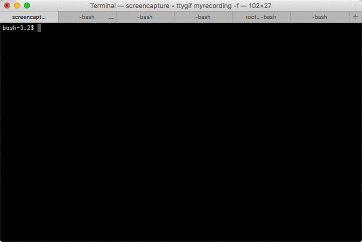

# mgo-intro
Introduction to mgo (MongoDB Go Driver) connecting to replica set

## Building

```
mkdir bin
go build -o bin/insert client/insert.go
go build -o bin/webserver web/server.go
go build -o bin/monitor terminal/monitor.go
```

## Setup
Starts replica set as: 

```
mongod --dbpath /data/gomongo/r1 --replSet gopher --wiredTigerCacheSizeGB 1 --port 30001
mongod --dbpath /data/gomongo/r2 --replSet gopher --wiredTigerCacheSizeGB 1 --port 30002
mongod --dbpath /data/gomongo/r3 --replSet gopher --wiredTigerCacheSizeGB 1 --port 30003
```

Initiate replica set
```
rs.initiate({_id:"gopher" members:[{_id:0, host:"localhost:30001"}]})
```

## Demo

Run client to insert random documents
```
while true; do echo 'inserting'; ./bin/insert; sleep 2; done
```

Run web server: 
```
./bin/webserver
```


Run terminal monitoring: 
```
./bin/monitor
```
('q' to quit)



